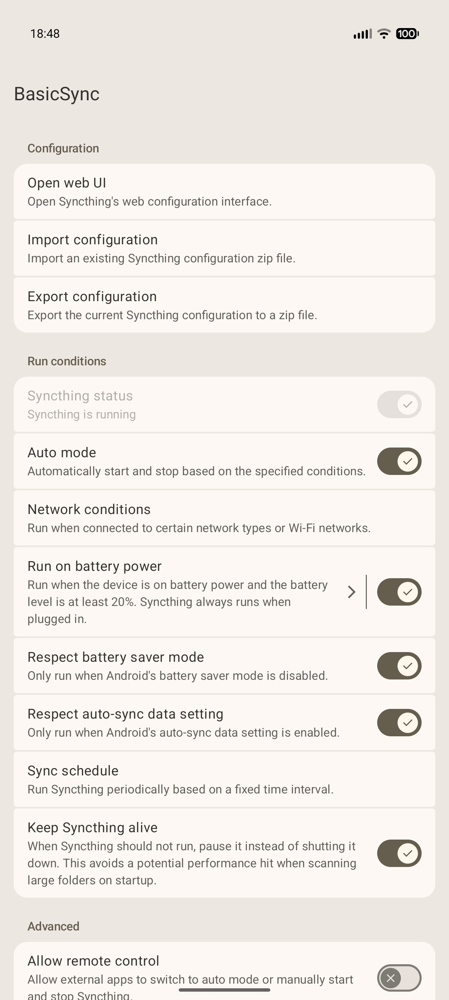
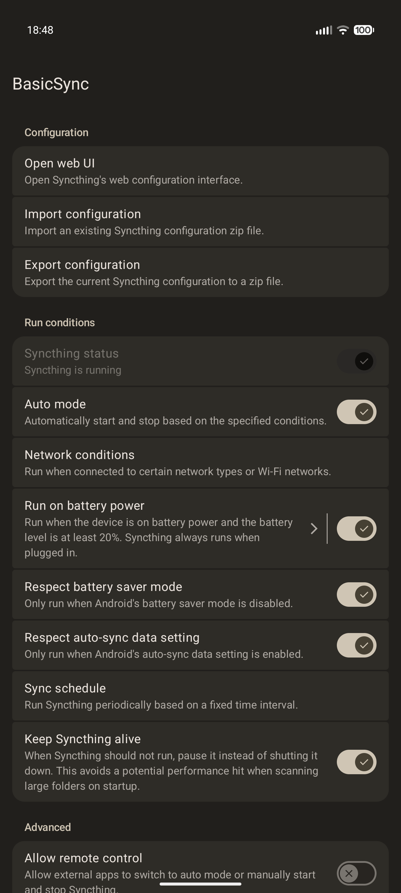

# BasicSync


BasicSync is a simple app for running Syncthing on Android.

The app is intentionally kept very basic so that the project is easy to maintain and keep updated. BasicSync only controls when Syncthing runs. The actual configuration is done through Syncthing's own web UI.

 

## Features

* Supports Android 8 and newer
* Supports external storage, like SD cards and USB drives
* Supports Android's [storage access framework](#storage-access-framework)
* Supports importing and exporting the configuration
* Supports pausing syncing based on network and battery conditions or on a periodic schedule
* Supports Android's HTTP proxy settings
* Quick settings tile to toggle between automatic and manual modes
* Optionally allows external apps to [start and stop](#remote-control) Syncthing
* Runs Syncthing as a library in the main process
    * This makes BasicSync immune to Android >=12's child process restrictions
* Small additions to Syncthing's web UI to add a folder picker and QR code scanner
* Detects and reports sync conflicts

## Usage

1. Download the latest version from the [releases page](https://github.com/chenxiaolong/BasicSync/releases). To verify the digital signature, see the [verifying digital signatures](#verifying-digital-signatures) section.

2. Grant the required permissions and set the desired run conditions.

3. That's it! Open the Syncthing web UI to configure it as would be done on a computer.

    By default, BasicSync runs in automatic mode where it starts and stops Syncthing based on the specified run conditions. However, this can be overridden by selecting "Manual mode" in BasicSync's notification, which allows manually controlling when Syncthing runs.

## Permissions

* `FOREGROUND_SERVICE`, `FOREGROUND_SERVICE_SPECIAL_USE` (Android >=14)
    * Needed to run Syncthing in the background indefinitely.
* `POST_NOTIFICATIONS`
    * Used for displaying the sync status and for providing a convenient way to manually start and stop Syncthing.
    * Android requires foreground services to show a notification to run reliably. Unwanted notifications can be hidden by disabling the relevant notification channel from Android's settings while still granting the overall permission.
* `INTERNET`
    * Only used to allow Syncthing to connect to the network.
    * BasicSync does not and will never have ads or telemetry of its own.
    * Syncthing has opt-in telemetry and asks for approval before any data it sent.
    * Syncthing's crash reporting is disabled because BasicSync integrates it in a way that is not supported upstream.
* `ACCESS_LOCAL_NETWORK` (Android >=17)
    * Needed for directly connecting to devices on the local network instead of passing through Syncthing's relay servers.
* `READ_SYNC_SETTINGS`
    * Used for detecting if Android's auto-sync data setting is enabled.
* `ACCESS_NETWORK_STATE`
    * Used for detecting when the device is connected to the network and if the network is unmetered.
* `MANAGE_EXTERNAL_STORAGE` (Android >=11), `READ_EXTERNAL_STORAGE`/`WRITE_EXTERNAL_STORAGE` (Android <11)
    * Optionally used for accessing internal and external storage when a folder is configured for direct file access instead of using Android's [storage access framework](#storage-access-framework).
* `RECEIVE_BOOT_COMPLETED`
    * Needed for automatically starting Syncthing after a reboot.
    * Autostart can be disabled from BasicSync's settings if desired.
* `REQUEST_IGNORE_BATTERY_OPTIMIZATIONS`
    * Needed to allow asking for permission to disable battery optimizations.
* `CAMERA`
    * Optionally used for scanning a device's QR code when adding a new device.
* `ACCESS_WIFI_STATE`, `ACCESS_COARSE_LOCATION`, `ACCESS_FINE_LOCATION`, `ACCESS_BACKGROUND_LOCATION`, `FOREGROUND_SERVICE_LOCATION`
    * Optionally used for stopping Syncthing unless connected to specific Wi-Fi networks. Android does not allow access to the SSID (Wi-Fi network name) without location permissions.
* `SCHEDULE_EXACT_ALARM`
    * Optionally used for the time schedule feature. Otherwise, Android may significantly delay both the start and end of the time windows.
    * The app will not prompt for this permission because it is only needed when battery optimizations are still enabled, which is strongly discouraged anyway.
* `INTERACT_ACROSS_USERS` (Android >=17)
    * Optionally used to allow two separate BasicSync instances installed in different Android profiles or users to talk to each other over localhost. Can only be granted via `adb`. See the [cross-user communication](#cross-user-communication) section for more details.

## Remote web UI access

Syncthing listens on the loopback interface and is available via `127.0.0.1:8384` by default. BasicSync will try to use the same port on every start, but will automatically pick a new random port if there is a conflict. The current port number can be found in Web UI -> Actions -> Settings -> GUI. HTTPS and basic authentication are both forcibly enabled every time Syncthing starts.

For basic authentication, the password is the API token. Generating new API tokens is supported, but setting an arbitrary password is not. BasicSync will internally set the password to the API token on every start.

## Storage access framework

**For GrapheneOS users**: Use the OS-level storage scopes feature instead. It allows direct file access without the limitations of Android's storage access framework described below.

BasicSync supports file access via Android's storage access framework (SAF) as an alternative to direct file access. This limits permissions so that Syncthing only has access to specific folders instead of all internal and external storage.

However, despite not having granular permissions, using direct file access is still recommended. SAF is discouraged because it is not well suited for how Syncthing accesses files.

* Accessing files by path is extremely inefficient. For example, it is not possible to directly access a nested file like `a/b/c`. Instead, Android will list every file in `a` and `b` and query their metadata before `c` is accessible. To reduce the impact of this, BasicSync caches directory listings and file metadata, but it will still be significantly slower than internal storage.

* SAF cannot report any watcher events more specific than "some file changed in this folder". When a file is changed, Syncthing needs to rescan the folder it's stored in instead of just the file. That said, leaving file watchers enabled is generally still a good idea if files aren't being frequently changed.

* SAF cannot guarantee that a creating a file will have the expected filename. When multiple processes try to create the same file at the same time, `file.txt` may be created as, for example, `file (1).txt`. BasicSync tries to reduce the chance of this happening within Syncthing, but it cannot protect from other apps writing to the same files.

When using SAF, there is higher chance of running into unexpected sync errors. If they occur, wait 5 minutes for BasicSync's caches to expire and then trigger a rescan of the folder from Syncthing's web UI. Due to SAF's limitations, this is the best that can be done.

**NOTE**: SAF support is a BasicSync feature, not a Syncthing feature. BasicSync has a large amount of code for bridging Syncthing's custom filesystem support to SAF. This means if the Syncthing config is exported from BasicSync and imported into another app, folders using SAF will not work properly.

### SAF custom filesystem scheme

For developers of other Syncthing apps, the custom filesystem scheme that BasicSync uses is:

* Filesystem type: `saf`
* Filesystem initialization path: `<URL-encoded SAF tree URI>[/<subpath>]`
    * The SAF tree URI is the `content://<authority>/tree/<document ID>` URI returned by Android's `ACTION_OPEN_DOCUMENT_TREE` folder selector.
    * The SAF tree URI is URL-encoded to prevent forward slashes from being included, while keeping the string relatively human-readable. It must not have forward slashes because Syncthing uses `filepath` APIs on the string and the URI must never be split apart since it's an opaque value.
    * When initialized with an empty string, a virtual root directory is returned containing one child entry for each of the persisted SAF URIs that the user has granted permissions to. The children's names are the URL-encoding of each persisted URI, the same as if the custom filesystem was initialized for that URI.
    * If a subpath is present, it represents a relative path within the SAF tree indicated by the first path component.
    * Supporting both the empty path and also subpaths allows Syncthing's `/rest/system/browse?filesystem=saf` API endpoint to work.

## Remote control

When the "Allow remote control" setting is enabled, BasicSync allows other apps to control when Syncthing runs via Android's broadcast mechanism. The following broadcast actions are supported, which behave exactly the same as the corresponding buttons in BasicSync's notification:

* `com.chiller3.basicsync.AUTO_MODE`
    * Switch to auto mode where Syncthing runs based on the configured run conditions.
* `com.chiller3.basicsync.MANUAL_MODE`
    * Switch to manual mode where Syncthing is manually started and stopped, but maintain the existing state.
    * If it was previously running, it will still be running. If it was previously stopped, it will still be stopped.
* `com.chiller3.basicsync.START`
    * Switch to manual mode and start Syncthing.
* `com.chiller3.basicsync.STOP`
    * Switch to manual mode and stop Syncthing.

These broadcasts can also be sent via `adb`. For example:

```bash
adb shell am broadcast -a com.chiller3.basicsync.AUTO_MODE com.chiller3.basicsync
```

## Android TV

BasicSync has basic support for Android TV. The UI is still the same phone/tablet UI, so navigation may be a bit awkward, but most functionality is accessible using the TV remote's arrow keys, including Syncthing's web UI.

However, there are several things that cannot be supported due to Android TV's limitations:

* Importing and exporting the configuration, as well as saving logs via debug mode, are not supported because Android TV does not include DocumentsUI (the system file manager and file picker).
* There is no way to see BasicSync's notification because Android TV does not support notifications from third party apps at all. BasicSync still needs to request the useless notifications permission to run Syncthing reliably in the background.
* Android TV has no UI for disabling "battery" optimizations, but it is also required for Syncthing to run reliably in the background. This must be done via adb instead:

    ```bash
    adb shell dumpsys deviceidle whitelist +com.chiller3.basicsync
    ```

## Persistent notification

Android 14 and newer [no longer allow](https://developer.android.com/about/versions/14/behavior-changes-all#non-dismissable-notifications) regular apps to prevent persistent notifications from being dismissed. To work around this, BasicSync will automatically show the persistent notification again whenever it is dismissed.

To prevent the notification from being dismissible in the first place (eliminating the UI jank from reshowing the notification), use adb to grant the `SYSTEM_EXEMPT_FROM_DISMISSIBLE_NOTIFICATIONS` appops permission:

```bash
adb shell appops set com.chiller3.basicsync SYSTEM_EXEMPT_FROM_DISMISSIBLE_NOTIFICATIONS allow
# To undo the change, change "allow" to "default".
```

Also, if the persistent notification is not desired, it can be disabled from Android's settings by turning off the two "Persistent notification" notification channels for BasicSync. Syncthing will continue to run as normal even if the notification is not visible as long as the overall notification permission is still granted.

## Cross-user communication

Android 17 [no longer allows](https://developer.android.com/about/versions/17/behavior-changes-all#block-cross-profile-loopback) apps to communicate with each other over localhost when they are running in different users. The affects both actual users and also profiles (eg. private space or work profile). For folks who run multiple instances of BasicSync to sync files locally between users, the sync traffic is now forced to go through Syncthing's relays due to this restriction.

However, the cross-profile/user communication permission can still be manually granted. This requires `adb` and BasicSync version 3.2 or newer.

1. Download the [`interact_across_users.sh`](./scripts/interact_across_users.sh) script from this repo. (Use the "Raw" button in the toolbar to get the file as plain text.)

2. Push the script to the device:

    ```bash
    adb push interact_across_users.sh /tmp/
    ```

3. Grant the `INTERACT_ACROSS_USERS` permission:

    ```bash
    adb shell sh /tmp/interact_across_users.sh grant
    ```

    This will grant the permission to every installed copy of BasicSync in any user and restart the app. If BasicSync is later installed in a new user, the script needs to be rerun.

    To undo the changes and revoke the permission, run:

    ```bash
    adb shell sh /tmp/interact_across_users.sh revoke
    ```

To actually set up communication between two BasicSync devices via localhost:

1. In each BasicSync instance, go to `Web UI -> Actions -> Settings -> Connections -> Sync Protocol Listen Addresses` and set a listen address with a fixed port number, such as `tcp://:22000`. Each instance needs a different port number.

2. After adding one BasicSync instance as a remote device to another BasicSync instance, go to `Web UI -> <Device name> -> Edit -> Advanced -> Addresses` and change the value from `dynamic` to `tcp://localhost:<port>`. This is necessary because Syncthing does not try to connect over localhost by default.

## Verifying digital signatures

First, use `apksigner` to print the digests of the APK signing certificate:

```
apksigner verify --print-certs BasicSync-<version>-<arch>-release.apk
```

Then, check that the SHA-256 digest of the APK signing certificate is:

```
08f8267bbd8827eaafc6f43294e5fb13e8e36e0bb2af2648d4e7b906cae713fa
```

## Building from source

Before building, the following tools must be installed:

* Android SDK
* Android NDK
* `go` (golang compiler)
  * We use a fork of golang that includes a fix for MTE-related crashes. However, an existing golang compiler must still be installed in order to build the fork from source.
    * https://github.com/golang/go/issues/27610
    * https://github.com/golang/go/issues/59090

Once the dependencies are installed, BasicSync can be built like most other Android apps using Android Studio or the gradle command line.

To build the APK:

```bash
./gradlew assembleDebug
```

The APK will be signed with the default autogenerated debug key.

To create a release build with a specific signing key, set the following environment variables:

```bash
export RELEASE_KEYSTORE=/path/to/keystore.jks
export RELEASE_KEY_ALIAS=alias_name

read -r -s RELEASE_KEYSTORE_PASSPHRASE
read -r -s RELEASE_KEY_PASSPHRASE
export RELEASE_KEYSTORE_PASSPHRASE
export RELEASE_KEY_PASSPHRASE
```

and then build the release APK:

```bash
./gradlew assembleRelease
```

### Android Studio

When loading the project in Android Studio, it might be necessary to build stbridge once first:

```bash
./gradlew stbridge
```

Even though AGP (Android Gradle Plugin) is set up so that `stbridge` is a `preBuild` dependency of all Android-related components, Android Studio seems to have trouble syncing the gradle project if stbridge's `.aar` file doesn't exist yet. There is no issue when building on the command line.

## Contributing

Bug fix pull requests are welcome and much appreciated!

Translation updates are primarily accepted via the [hosted Weblate project](https://hosted.weblate.org/projects/syncthing/android/basicsync/), which is generously provided by the upstream Syncthing project. However, translation updates via pull requests are accepted as well.

If you are interested in implementing a new feature and would like to see it included in BasicSync, please open an issue to discuss it first. This is a side project that I work on for fun, so I'm hesitant to add features I won't personally use. I intend for BasicSync to be as simple and low-maintenance as possible.

## License

BasicSync itself is licensed under GPL-3.0-only. Please see [`LICENSE`](./LICENSE) for the full license text.

The bundled Syncthing, along with the additional patches applied in [BasicSync's fork](https://github.com/chenxiaolong/syncthing), is [licensed under MPL-2.0](https://github.com/syncthing/syncthing/blob/main/LICENSE).
